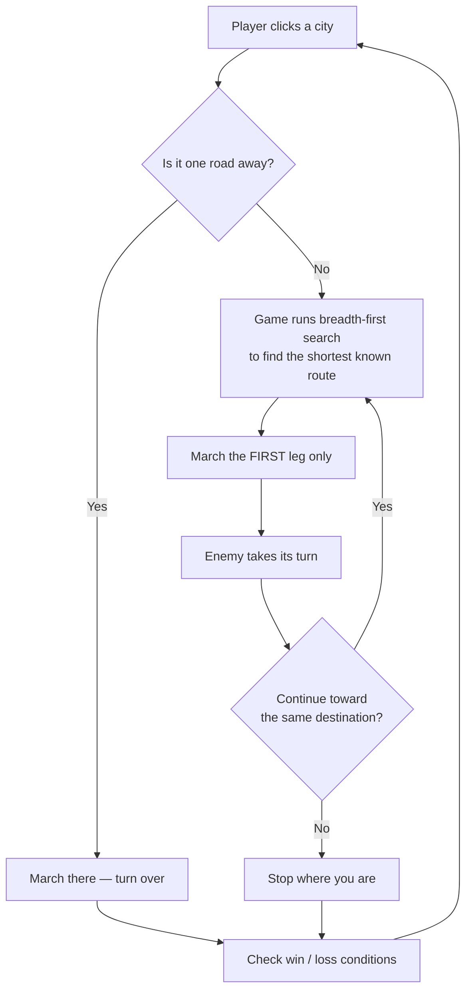
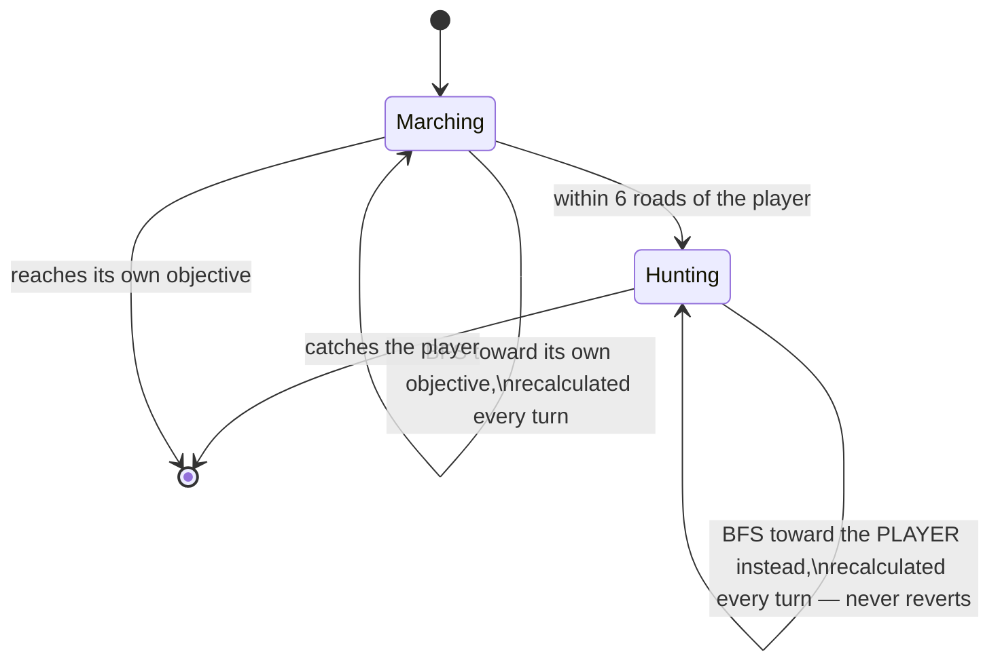
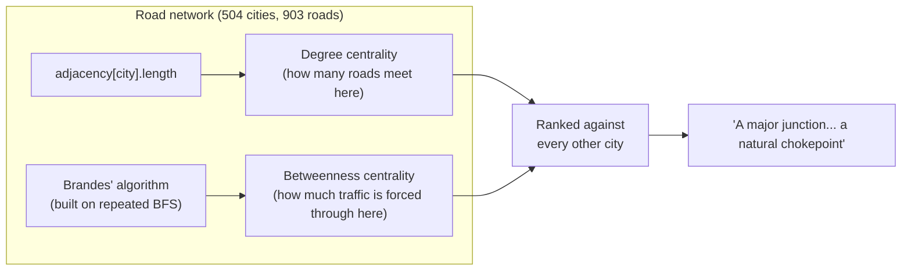

<div align="center">

# 🏛️ ROME: THE LAST MARCH

### *Seven campaigns. One road each time. The enemy does not wait for you.*

**A single-file, no-build browser strategy game built on real Roman road data — and real graph theory.**

[](#-quick-start)
[](#-quick-start)
[-8a1f11?style=flat-square)](#-the-data)
[](#-tech-at-a-glance)

</div>

<br>

<p align="center">
  
</p>

<br>

## 📜 What is this?

**Rome: The Last March** drops you into one of seven pivotal moments of Roman history — Hannibal at Trasimene, Caesar crossing the Rubicon, Actium — as a randomly-drawn character (a legionary officer, a camp scribe, a camp cook, a praetor, a consul) sent ahead of the main army. You and an enemy force are both racing across a real historical road network toward your own objective cities. Reach yours first, or be caught.

Nothing is hidden. The whole theater is on the map, you can always see exactly where the enemy is, and its live route — recalculated every turn — is drawn right alongside yours. The tension isn't fog of war; it's the same shortest-path search running for both of you, in real time, over a graph with real branching and real consequences for the road you choose.

<br>

<p align="center">
  
</p>

<br>

## ✨ Features

- 🗺️ **A real Roman road network** — 504 cities, 903 roads, built from the [Digital Atlas of the Roman Empire](#-the-data) (DARE), not a hand-drawn approximation
- 🎭 **A different character every playthrough** — soldier, scribe, cook, praetor, or consul, each with a portrait and a mission briefing written for who they are
- ⚖️ **A fairness-checked start** — starting positions are randomized every game, but stress-tested so the enemy's own march is never trivially shorter than yours
- 🧭 **Fully transparent BFS routing** — click any city, however far, and the game plots the same breadth-first search the enemy uses; every leg plays out turn by turn, never a full precomputed itinerary
- 👁️ **A visible, adapting enemy** — the enemy's live route is drawn on the map at all times, and flips to actively hunting you the moment you're within range, flaring bright magenta the instant it happens
- 📊 **Graph theory woven into the map itself** — click any city to see its actual [degree and betweenness centrality](#-network-science-under-the-hood), computed live, not scripted
- 🎼 **An original score**, looping under the whole campaign
- 📦 **Zero install, zero build step** — the entire game (data, art, audio, everything) is one `index.html` file

<br>

<p align="center">
  
</p>

<br>

## 🚀 Quick start

No build tools, no dependencies, no server required.

```bash
git clone https://github.com/<your-username>/<your-repo>.git
cd <your-repo>
open index.html        # macOS
# or just double-click index.html in your file browser
```

**Play it online:** enable **GitHub Pages** for this repo (Settings → Pages → Deploy from branch → `main` / `root`) and the game is live at `https://<your-username>.github.io/<your-repo>/` within a minute of pushing.

> **Note:** the background score needs a real browser tab to autoplay (browsers block audio until they see a genuine click) — it starts the moment you click *Begin the March*.

<br>

## 🧭 How a turn works



No leg past the first is ever computed in advance — you decide again after every single hop, with full knowledge of where the enemy moved to in response.

<br>

## 🐺 The enemy's mind



The enemy's route line is drawn live on the map the entire game — amber while marching, magenta and faster-pulsing the instant it starts hunting — so its intentions are never a secret, only its next move.

<br>

## 📊 Network science under the hood

Every city you click shows a line on its **strategic value** — something like *"a major junction, 5 roads meeting here"* followed by *"a natural chokepoint: far more routes pass through here than through most cities."* That isn't flavor text — it's computed live, the same way you'd do it in an intro network-science course:



These are exactly the measures of **"who matters, and why"** covered in Week 3 of DTU's [Social Graphs and Interactions](https://sunelehmann.com/socialgraphs2026-web/weeks/week3.html) course — degree centrality and betweenness centrality — built on the very same breadth-first search the game already uses to march you and the enemy across the map, just run once for every city instead of one route at a time.

<br>

## 🗺️ The data

| | |
|---|---|
| **Source** | [Digital Atlas of the Roman Empire](https://dare.ht.lu.se) (DARE), via the [klokantech/roman-empire](https://github.com/klokantech/roman-empire) map project |
| **Cities** | 504 total — 494 use DARE's own surveyed coordinates directly; the rest (a lake, a mountain pass, a river crossing) are reconstructed because DARE carries no point for them |
| **Roads** | 903 total — 618 directly attested in DARE's road-segment data, traced point for point; 285 are reconstructed straight-line gaps, clearly marked as such in-game |
| **Waypoints** | 398 of the 504 cities are waypoint towns layered on top of the historical hub cities — 208 string out the longer roads between hubs, and 190 are real nearby places branched in wherever a stretch would otherwise be a forced single-file corridor |

Hover any road in-game to see whether it's attested or reconstructed.

<br>

## 🛠️ Tech at a glance

- **Everything in one file** — HTML, CSS, JavaScript, the full road graph (as JSON), character portraits, the background image, and the score are all embedded directly in `index.html` as inline data, so the whole game is portable as a single download
- **No frameworks, no build step** — vanilla JS throughout, including the BFS pathfinding, the fairness algorithm for start positions, and the Brandes' betweenness-centrality computation, which runs client-side in well under a second across all 504 cities
- **`gen_html.py`** — the Python build script that assembles the final `index.html` from the graph data, campaign text, and embedded media; regenerate it after any data or content change

<br>

## 🏺 Campaigns

| Campaign | Era |
|---|---|
| The Second Punic War | 218–216 BCE |
| The Gallic Wars | 52 BCE |
| The First Jewish-Roman War | 67 CE |
| Trajan's Dacian Wars | 101 CE |
| Caesar's Civil War | 49 BCE |
| Marius and Sulla | 88 BCE |
| Actium | 31 BCE |

<br>

<div align="center">

*Every road is real. The enemy is real-time. The rest is up to you.*

</div>
